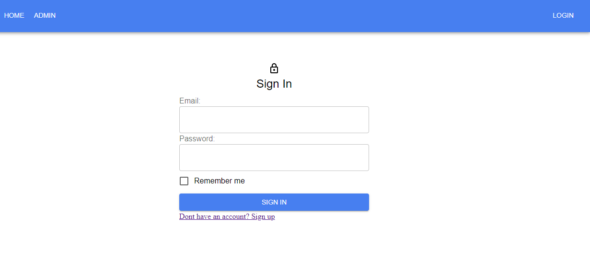

    

# MERN Application

A simple MERN Stack App made for practice & learning. CRUD, Authentication with JWT & Deployment using Netlify and Heroku.

[APP Demo.](https://mern-mini-social.netlify.app/)

[Backend Code.](https://github.com/mkimbo/mern-project-server)

[Frontend Code.](https://github.com/mkimbo/mern-project-client)

## Technologies

- React
- Material UI v5
- NodeJs
- Express
- MongoDb
- JWT

Features:

- User Authentication with Json Web Tokens (Access and Refresh Tokens)
- Persistant login (Remember device based on user preference)
- Tokens stored in HttpOnly Cookies for security
- Role-based user authorization
- CRUD operations API

# Author

[@JackMkimbo](https://twitter.com/JackMkimbo)
